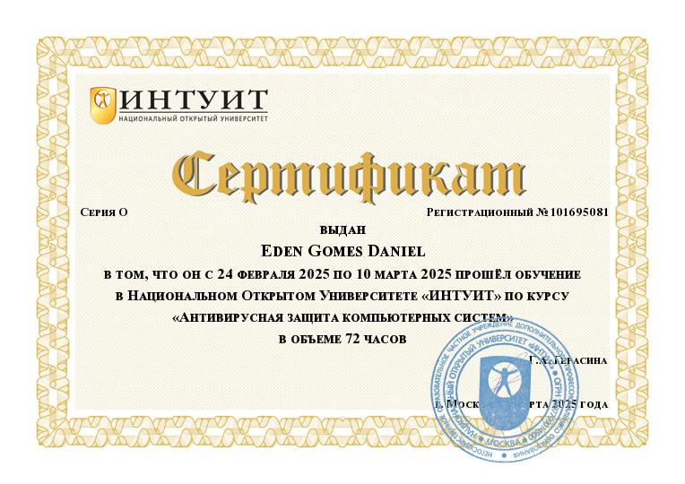
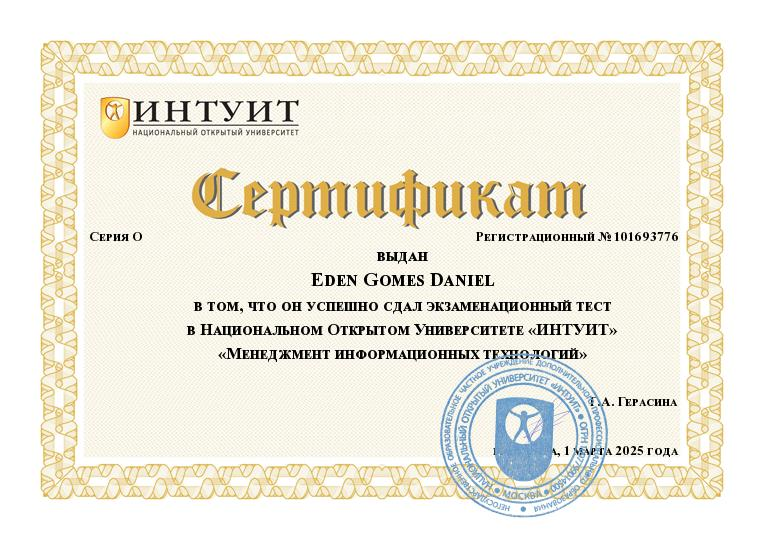

# 📜 Meus Certificados

# 📑 Certificações & Validação Profissional

Este repositório centraliza minhas certificações, exames de suficiência e capacitações formais nas áreas de **Segurança da Informação, Cibersegurança e Governança de TI**. 

Mais do que um registro acadêmico, cada conquista listada aqui representa a base teórica e normativa que sustenta os meus laboratórios práticos, garantindo o alinhamento entre a resposta técnica a ameaças e as melhores práticas de conformidade e gestão do mercado.

---

### 🚀 Como navegar
* **Acesso Direto:** Todos os certificados e exames possuem links ativos para visualização imediata da credencial ou do documento comprobatório.
* **Conexão Prática:** Os cursos técnicos estão diretamente vinculados aos seus respectivos laboratórios em desenvolvimento neste perfil, demonstrando a aplicação real dos conceitos absorvidos.

---

## 🔐 Segurança da Informação & Cibersegurança

### 🎓 Cursos e Certificações

* **Cyberbezpieczeństwo dla firm – szkolenie z podstaw bezpieczeństwa**
  * **Instituição:** Comarch SA – Centro de Treinamento
  * **Período:** Abril de 2025
  * **Descrição:** Capacitação focada na identificação de vetores de ataque contemporâneos e na implementação de controles defensivos básicos. O curso abordou governança de segurança, mitigação de riscos humanos e a aplicação prática de políticas de proteção de dados no ambiente empresarial.
  * **Laboratório Prático (Em desenvolvimento):** 🛠️ [Corporate-Hardening-Lab](https://github.com/seu-usuario/corporate-hardening-lab) _(Projeto focado na implementação prática dos controles defensivos, hardening de servidores e monitoramento de logs discutidos no treinamento)_

  🔗 

* **Fundamentos de Segurança da Informação**
  * **Instituição:** Universidade Nacional Aberta “INTUIT”
  * **Carga Horária / Período:** 72 horas | Fevereiro – Março de 2025
  * **Descrição:** Formação sólida nos pilares fundamentais da segurança da informação (Tríade CID: Confidencialidade, Integridade e Disponibilidade). O curso abrangeu a análise e modelagem de riscos digitais, identificação de vulnerabilidades em sistemas e a aplicação de mecanismos de controle para proteção de ativos.
  * **Aplicação Prática (Em desenvolvimento):** 🔬 [Security-Fundamentals-Lab](https://github.com/seu-usuario/security-fundamentals-lab) _(Laboratório focado na simulação, análise e mitigação de vulnerabilidades baseadas em falhas nos pilares da segurança da informação)_ 

  🔗 

  🔗 

---

## 🦠 Malware, Vírus & Proteção de Sistemas

* **Proteção Antiviral de Sistemas Informáticos**
  * **Instituição:** Universidade Nacional Aberta “INTUIT”
  * **Carga Horária / Período:** 72 horas | Fevereiro – Março de 2025
  * **Descrição:** Estudo aprofundado sobre a arquitetura de softwares antivírus, métodos de detecção de ameaças (assinatura, heurística e análise comportamental) e mecanismos avançados de defesa em sistemas computacionais. Abordagem voltada para a compreensão de vetores de infecção e mitigação de códigos maliciosos.
  * **Laboratório Prático (Em desenvolvimento):** 🧬 [Malware-Analysis-Defense-Lab](https://github.com/seu-usuario/malware-analysis-defense-lab) _(Repositório dedicado ao estudo e documentação de análise de binários, engenharia reversa de artefatos e testes de eficácia de mecanismos antivírus)_

  🔗 

* **Vírus e Métodos de Combate**
  * **Instituição:** Universidade Nacional Aberta “INTUIT”
  * **Carga Horária / Período:** 72 horas | Março – Abril de 2025
  * **Descrição:** Análise técnica aprofundada da taxonomia de códigos maliciosos (malware), mapeamento de vetores de infecção e estudo de técnicas avançadas de mitigação. O curso abordou o ciclo de vida de explorações e metodologias estruturadas para resposta a incidentes e contenção de ameaças em sistemas comprometidos.
  * **Aplicação Prática (Em desenvolvimento):** 🛠️ [Exploit-Lifecycle-Lab](https://github.com/seu-usuario/exploit-lifecycle-lab) _(Repositório voltado à documentação de ponta a ponta: desde a simulação controlada de vetores de ataque e técnicas de evasão até a análise de memória de baixo nível e aplicação de contramedidas)_

  🔗 

---

## 🧠 Sistemas & Gestão de Tecnologia da Informação

* **Exame Oficial: Fundamentos de Sistemas de Informação**
  * **Instituição:** Universidade Nacional Aberta “INTUIT”
  * **Data de Emissão:** Março de 2025
  * **Descrição:** Certificação obtida por meio de exame oficial de suficiência, validando proficiência na arquitetura, componentes essenciais e funcionamento estrutural de Sistemas de Informação. A aprovação comprova o domínio técnico sobre o ciclo de vida dos dados, governança de infraestrutura e a integração segura de tecnologias organizacionais.
  * **Aplicação Prática (Em desenvolvimento):** 🏗️ [Secure-Architecture-Lab](https://github.com/seu-usuario/secure-architecture-lab) _(Repositório dedicado à modelagem de ameaças e design de infraestruturas seguras, aplicando conceitos de segurança desde a fundação dos sistemas)_

  🔗 

* **Exame Oficial: Gestão de Tecnologia da Informação**
  * **Instituição:** Universidade Nacional Aberta “INTUIT”
  * **Data de Emissão:** Março de 2025
  * **Descrição:** Certificação obtida por meio de exame oficial, validando competências em governança de TI, gestão de processos de negócios e alinhamento estratégico entre tecnologia e objetivos organizacionais. A aprovação comprova o domínio em frameworks de gestão, mitigação de riscos operacionais e ciclo de vida de serviços tecnológicos.
  * **Aplicação Prática (Em desenvolvimento):** 📊 [IT-Governance-Security](https://github.com/seu-usuario/it-governance-security) _(Repositório voltado para a documentação de políticas de segurança, gerenciamento de ativos, auditoria de processos e conformidade aplicados a infraestruturas de TI)_ 

  🔗 

---

## ℹ️ Observações

- Repositório com finalidade **acadêmica e profissional**.
- Certificados obtidos por meio de **estudos e avaliações formais**.
- Documentos disponíveis no diretório [`certificados`](./certificados).

