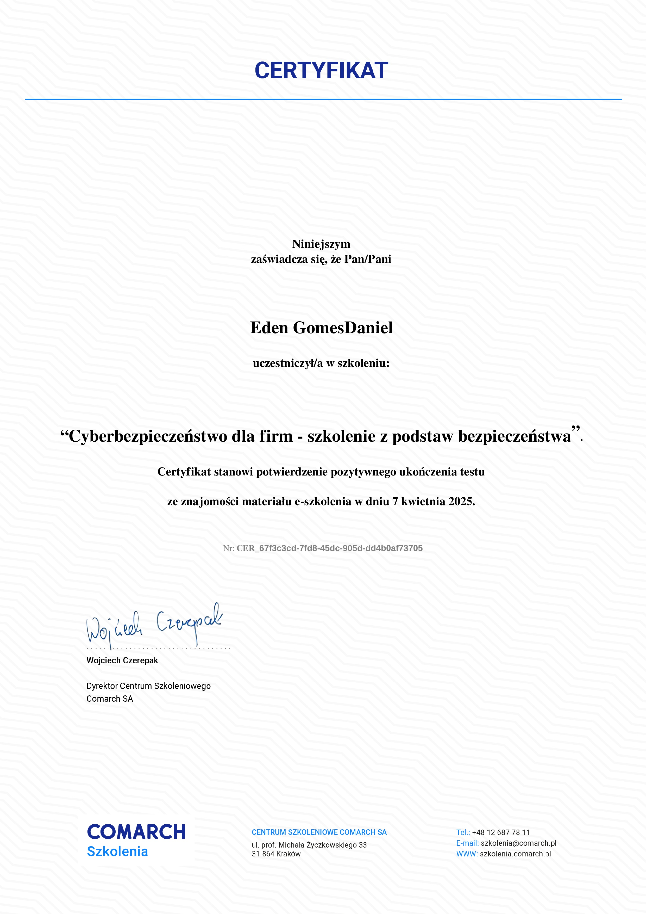

# 📜 Meus Certificados

Este repositório reúne certificados obtidos por meio de estudos, cursos e exames formais,
com foco em **Segurança da Informação**, **Cibersegurança** e **Tecnologia da Informação**.

Todos os certificados estão disponíveis com **acesso direto** (clique no link para visualizar).

---

## 🔐 Segurança da Informação & Cibersegurança

- **Cyberbezpieczeństwo dla firm – szkolenie z podstaw bezpieczeństwa**  
  *Comarch SA – Centro de Treinamento*  
  📅 Abril de 2025  
  📝 Treinamento introdutório sobre fundamentos de segurança da informação e
  boas práticas de cibersegurança no ambiente corporativo.  
  🔗 

- **The Basics of Information Security**  
  *(Fundamentos de Segurança da Informação)*  
  *National Open University “INTUIT”*  
  ⏱️ 72 horas | 📅 Fev–Mar 2025  
  📝 Conceitos fundamentais de segurança da informação, confidencialidade,
  integridade, disponibilidade e riscos digitais.  
  🔗 [Visualizar certificado](./certificados/noção%20básica%20se%20seguranca%20dainformação_RU.jpg)

- **Fundamentos de Segurança da Informação (RU)**  
  *Universidade Nacional Aberta “INTUIT”*  
  ⏱️ 72 horas | 📅 2025  
  📝 Abordagem teórica e prática sobre princípios de proteção da informação
  e políticas básicas de segurança.  
  🔗 [Visualizar certificado](./certificados/fundamentos_seginfo_RU.jpg)

---

## 🦠 Malware, Vírus & Proteção de Sistemas

- **Antiviral Protection of Computer Systems**  
  *National Open University “INTUIT”*  
  ⏱️ 72 horas | 📅 Fev–Mar 2025  
  📝 Estudo dos principais métodos de proteção antivírus, detecção de ameaças
  e mecanismos de defesa em sistemas computacionais.  
  🔗 [Visualizar certificado](./certificados/protAnt_siscomp_RU.jpg)

- **Viruses and Methods of Combating Them**  
  *National Open University “INTUIT”*  
  ⏱️ 72 horas | 📅 Mar–Abr 2025  
  📝 Análise de tipos de malware, vetores de infecção e técnicas utilizadas
  para mitigação e resposta a incidentes.  
  🔗 [Visualizar certificado](./certificados/virus%20e%20meios%20de%20combaterRU.jpg)

---

## 🧠 Sistemas & Gestão de Tecnologia da Informação

- **Aprovação em Exame – Fundamentos de Sistemas de Informação**  
  *National Open University “INTUIT”*  
  📅 Março de 2025  
  📝 Certificação obtida por meio de exame oficial, validando conhecimentos
  sobre sistemas de informação e seus componentes.  
  🔗 [Visualizar certificado](./certificados/Fund_Sintem_info_RU.jpg)

- **Aprovação em Exame – Gestão de Tecnologia da Informação**  
  *National Open University “INTUIT”*  
  📅 Março de 2025  
  📝 Avaliação focada em conceitos de gestão de TI, governança,
  processos e alinhamento tecnológico.  
  🔗 [Visualizar certificado](./certificados/gestao-tecInfo_RU.jpg)

---

## ℹ️ Observações

- Repositório com finalidade **acadêmica e profissional**.
- Certificados obtidos por meio de **estudos e avaliações formais**.
- Documentos disponíveis no diretório [`certificados`](./certificados).

